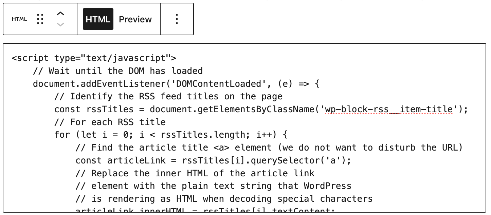
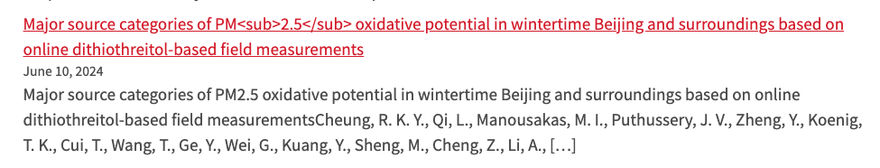
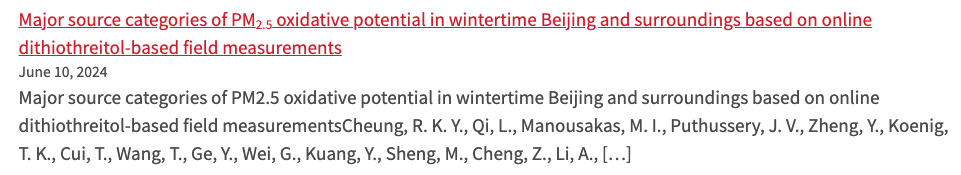

# Pure RSS — WordPress RSS Block Render Fix

A sample script for fixing incorrectly rendered article titles in WordPress RSS blocks.

## Table of Contents

- [Description](#description)
- [Prerequisites](#prerequisites)
- [Installation](#installation)

## Description

Many departments at the School of Medicine are presenting recent research outputs on their respective websites by leveraging the organization's RSS feed in [Research Profiles](https://profiles.wustl.edu). WordPress has been widely adopted at the university, and the displaying of RSS feed items on a page within WordPress is easily done by using the built-in "RSS Block." However, we occasionally observe titles that contain special characters (e.g., subscript tags `<sub>`) that are not rendered by WordPress in a way that handles these tags as HTML. Instead, they are printed out directly to the screen. The `wp-rss-fix.js` script rewrites the article titles and corrects the rendering.

## Prerequisites

Other than the ability to add a 'Custom HTML Block' to a WordPress page or post, there are no technical prerequisites. This is plain JavaScript that will be executed by the browser.

## Installation

Clone the repository if you like or copy and paste from the files directly. There are two options.

- Add the `wp-rss-fix.js` file to your custom theme or plugin and load via the `wp_enqueue_script()` function.

### OR

- Add a WordPress 'Custom HTML Block' on the target pages of interest and place the contents of the `wp-rss-fix.js` file there, wrapped with `<script>` tags. Working example below:

```javascript
<script type="text/javascript">
    // Define a regular expression pattern to check for HTML elements
    const re = /<[a-zA-Z]+>/;
    // Wait until the DOM has loaded
    document.addEventListener('DOMContentLoaded', (e) => {
        // Identify the RSS feed titles on the page
        const rssTitles = document.getElementsByClassName('wp-block-rss__item-title');
        // For each RSS title
        for (let i = 0; i < rssTitles.length; i++) {
            // Find the article title <a> element (we do not want to disturb the URL)
            const articleLink = rssTitles[i].querySelector('a');
            // If the text content of the article link 
            // contains HTML elements,replace the inner HTML 
            // of the article link element with the plain text string 
            // that WordPress is rendering as HTML when decoding special characters
            if (re.test(articleLink.textContent)) {
                articleLink.innerHTML = rssTitles[i].textContent;
            }
        }
    });
</script>
```

### Sample screenshots from within WordPress

#### The 'Custom HTML Block'


#### Embedded Script



#### Display Before



#### Display After


