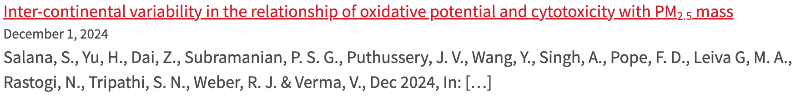

# Pure RSS — WordPress RSS Block Render Fix v.2.1.0

A sample script for fixing incorrectly rendered article titles in WordPress RSS blocks.

## Table of Contents

- [Description](#description)
- [Prerequisites](#prerequisites)
- [Installation](#installation)

## Description

Many departments at the School of Medicine are presenting recent research outputs on their respective websites by leveraging the organization's RSS feed in [Research Profiles](https://profiles.wustl.edu). WordPress has been widely adopted at the university, and the displaying of RSS feed items on a page within WordPress is easily done by using the built-in "RSS Block." However, we occasionally observe titles that contain special characters (e.g., subscript tags `<sub>`) that are not rendered by WordPress in a way that handles these tags as HTML. Instead, they are printed out directly to the screen. The `wp-rss-fix.js` script rewrites the article titles and corrects the rendering.

An additional issue noted is that, when electing to show the RSS feed excerpts, the article title is duplicated in the excerpt content, the list of article authors appearing after with no space separating them. This script also allows for this duplicated text in the excerpt to be removed.

## Prerequisites

Other than the ability to add a 'Custom HTML Block' to a WordPress page or post, there are no technical prerequisites. This is plain JavaScript that will be executed by the browser.

## Installation

Clone the repository if you like or copy and paste from the files directly. There are two options.

- Add the `wp-rss-fix.js` file to your custom theme or plugin and load via the `wp_enqueue_script()` function.

### OR

- Add a WordPress 'Custom HTML Block' on the target pages of interest and place the contents of the `wp-rss-fix-embeddable.js` file there, wrapped with `<script>` tags. <u>The primary difference is that the embeddable version uses an obnoxious nexting of `if` conditional statements due to WordPress' escaping/encoding of the `&&` comparison operator when attempting to combine conditions in one line</u>. Working example below:

```javascript
<script>
// Embeddable version. Copy/paste and wrap in <script> tags.
// Script to fix WordPress special character 
// rendering in RSS feeds.

// After the DOM has loaded, call pureRSSCleaner
document.addEventListener('DOMContentLoaded', (e) => {
    pureRSSCleaner(true, true);
    hideRSSErrors();
});

// pureRSSCleaner corrects improperly encoded HTML
// tags in RSS item titles and also strips
// title content repeated in the excerpt.
// Function parameters are booleans.
function pureRSSCleaner(title, excerpt) {
    // Define a regular expression pattern to check for HTML elements
    const re = /<[a-zA-Z]+>/;

    // Identify the RSS feed items on the page
    const rssItems = document.getElementsByClassName('wp-block-rss__item');

    // For each item in the feed
    for (let i = 0; i < rssItems.length; i++) {
        // Attempt to store the associated title and excerpt
        const itemTitle = rssItems[i].getElementsByClassName('wp-block-rss__item-title');
        const itemExcerpt = rssItems[i].getElementsByClassName('wp-block-rss__item-excerpt');

        // Create a shadow element to store corrected title.
        // This is useful in the event where it is
        // desired to rewrite the excerpt but
        // not the title.
        const shadowTitle = document.createElement('a');

        // Confirm that the title exists before attempting to access
        if (itemTitle.length > 0) {
            // Find the article title <a> element (we do not want to disturb the URL)
            const itemTitleLink = itemTitle[0].querySelector('a');
            
            // Set the shadowTitle.innerHTML to the textContent of the itemTitle
            shadowTitle.innerHTML = itemTitle[0].textContent;

            // If 'title' is set to true and the itemTitle exists
            if (title) {
                // If the text content of the article link 
                // contains HTML elements,replace the inner HTML 
                // of the article link element with the plain text string 
                // that WordPress is rendering as HTML when decoding special characters
                if (re.test(itemTitleLink.textContent)) {
                    itemTitleLink.innerHTML = itemTitle[0].textContent;
                }
            }
        }

        // If `excerpt` is set to true and the itemTitle and itemExcerpt exists,
        // strip the title content from the excerpt
        if (excerpt) {
            if (itemTitle.length > 0) {
                if (itemExcerpt.length > 0) {
                    let excerptContent = itemExcerpt[0].textContent;
                    let titleContent = shadowTitle.textContent;
                    // Remove extra whitespace and breaks from title
                    titleContent = titleContent.replace(/\s\s+/g, " ");
                    // Remove extra whitespace and breaks from excerpt
                    excerptContent = excerptContent.replace(/\s\s+/g, " ");
                    // Remove titleContent from excerptContent
                    excerptContent = excerptContent.replace(titleContent, "");
                    // Replace original item excerpt with cleaned content
                    itemExcerpt[0].textContent = excerptContent;
                }
            }
        }
    }
}

// hideRSSErrors suppresses the display of the WordPress 'RSS Error'
// notice when a problem with the RSS link arises.
function hideRSSErrors() {
    // Identify all of the component-placeholder div elements
    const componentsPlaceholders = document.getElementsByClassName('components-placeholder');

    // For each component, hide if it contains the text "RSS Error"
    for (let i = 0; i < componentsPlaceholders.length; i++) {
        if (componentsPlaceholders[i].textContent.includes("RSS Error")) {
            componentsPlaceholders[i].style.display = "none";
        }
    }
}
</script>
```
The primary function `pureRSSCleaner(title, excerpt)` accepts two parameters, both booleans, that allow you to address issues related to the titles, excerpts, or both.

The additional function `hideRSSError()` just needs to be called.

### Sample screenshots from within WordPress

#### The 'Custom HTML Block'


#### Embedded Script


#### Display Before


#### Display After


